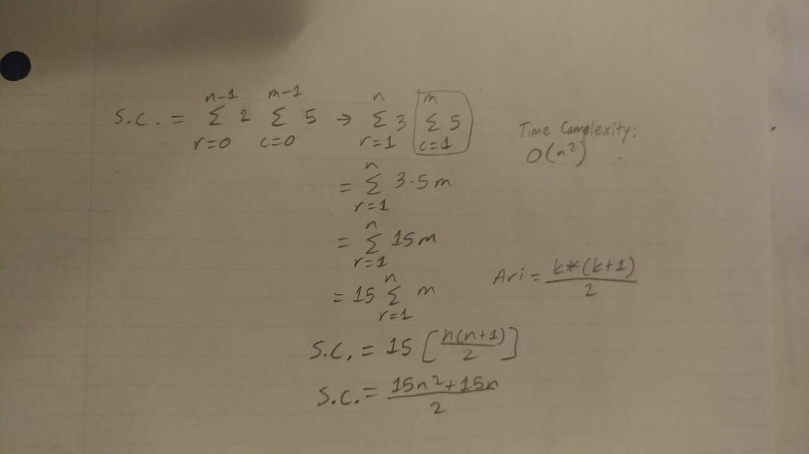

# Exhaustive Alogrithm Pseudocode 
**Problem:** Get the route that maximizes the number of cranes reached while avoiding buildings.

**i/p:** a 2D array  of n > 0 numbers. 

**o/p:** the path that gives the most cranes and least buildings.

**Pseudocode**

Cranes[5] = {#, #, #, #, #}

Buildings[5] = {#, #, #, #, #}

Path[5][9]

For row = 0 to n - 1 do → n - 1 + 1 = n times

    current path is established → 1 tu

    For column = 0 to m - 1 do → m - 1 + 1 = m times
        
        truck goes east → 1 tu

        if current path goes out of bounds then → 2 tu
            
            truck goes south → 1 tu

        if truck goes outside of grid then → 1 tu

            stop (break) 
        endif

        truck goes east or west depending on direction → 1 tu
    
    endfor

    if total cranes of current path > total cranes of best path then → 1 tu

        best path = current path → 1 tu
    
    endif 

return best path

endfor

**Step Count:** 

**Time Complexity:** O(n^2)

# Dynamic Algorithm Pseudocode 

**Problem:** Get the route that maximizes the number of cranes reached while avoiding buildings.

**i/p:** a 2D array  of n > 0 numbers. 

**o/p:** the path that gives the most cranes and least buildings.

**Pseudocode**

Cranes[5] = {#, #, #, #, #}

Buildings[5] = {#, #, #, #, #}

Path[5][9]

For row = 0 to n - 1 do → n - 1 + 1 = n times

    For column = 0 to m - 1 do → m - 1 + 1 = m times

        if row OR column == 0 → 2 tu

            Path[row][column] = 0 → 1 tu

        else if Building[row] <= column → 1 tu

            Path[row][column] = max(Cranes[row] + Path[row - 1][column - Buildings[row]],

            Path [row - 1][column]) → 5 tu

        else Path[row][column] = Path[row - 1][column] → 2 tu

        endif

    endfor

    return Path[row][column]

endfor

**Step Count:** 

**Time Complexity:** O(n^2)

# Exhaustive vs. Dynamic Graph

Here in this graph, we can see the time it takes for the exhaustive algorithm (represented by the red line) in comparison to the dynamic algorithm (represented by the blue line). The exhaustive algorithm here is more inefficient in comparison to the dynamic algorithm, despite being the same time complexity.